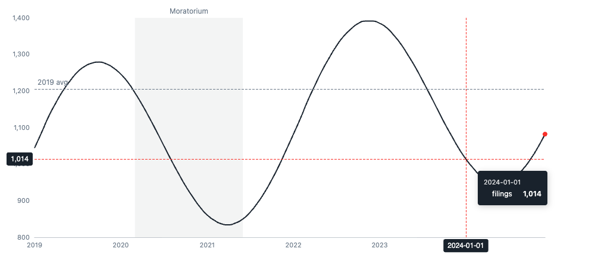
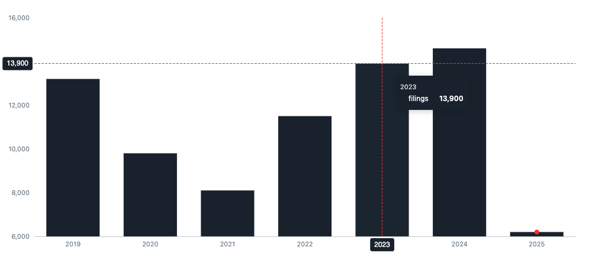
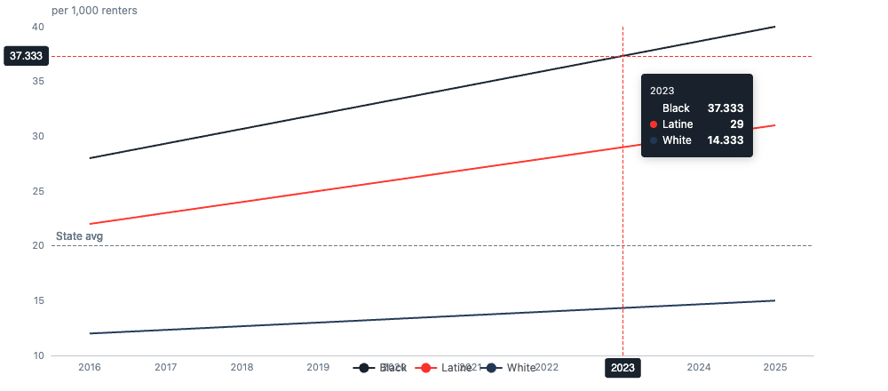

```{r, include = FALSE}
knitr::opts_chunk$set(collapse = TRUE, comment = "#>", eval = FALSE)
```

This tutorial builds the "newspaper graphic" charts used in the
[Eviction Research Network](https://evictionresearch.net) state profiles
(Washington, Minnesota) — clean trend and bar charts where **hovering reveals
the scale**: a crosshair tracks the cursor and prints the value right on the
y-axis, next to a tooltip. Like the mapping functions, the charts are a thin,
deterministic wrapper — here over [echarts4r](https://echarts4r.john-coene.com/)
(John Coene), which bundles Apache ECharts — and `nt_chart()` returns the raw
`echarts4r` widget, so you can keep piping `e_*` functions for anything it
doesn't expose.

```{r setup}
library(neighborhood)
```

## 1. A trend line in one call

Give `nt_chart()` a data frame, the x and y column names, and a type:

```{r}
filings <- data.frame(
  month   = seq(as.Date("2019-01-01"), by = "month", length.out = 72),
  filings = round(1000 + 250 * sin(seq_len(72) / 6) + seq_len(72) * 3)
)

nt_chart(filings, "month", "filings", type = "line")
```

Hover the line: a red dashed crosshair snaps to the nearest month, the filing
count is printed on the y-axis at that height, and a dark tooltip shows the month
and value. That hover-reveals-the-axis behavior is the signature ERN interaction,
on by default (`crosshair = TRUE`).

Dates become a time axis automatically; integer years or text categories become a
category axis. `y` values format as thousands by default — switch with
`value_fmt = "percent"` or `"currency"`.

## 2. Editorial touches: baseline, band, focal point

The state-profile trend charts mark a **pre-pandemic baseline**, shade the
**eviction-moratorium window**, and highlight the **latest point**. Each is one
argument:

```{r}
nt_chart(
  filings, "month", "filings", type = "line",
  baseline       = mean(filings$filings[1:12]),               # dashed reference line
  baseline_label = "2019 average",
  band           = c(as.Date("2020-03-01"), as.Date("2021-06-01")),  # shaded window
  band_label     = "Moratorium",
  highlight_last = TRUE                                        # accent the latest month
)
```

```{r trend-chart, eval=TRUE, echo=FALSE, out.width="100%", fig.cap="Example output (shown mid-hover): the crosshair tracks the cursor and prints the value on the y-axis, with the dashed baseline, shaded moratorium band, and the accented latest point."}

```

## 3. Bar charts (yearly totals)

```{r}
yearly <- data.frame(
  year    = 2019:2025,
  filings = c(13200, 9800, 8100, 11500, 13900, 14600, 6200)  # last year partial
)

nt_chart(yearly, "year", "filings", type = "bar", highlight_last = TRUE)
```

```{r bar-chart, eval=TRUE, echo=FALSE, out.width="100%", fig.cap="Example output: yearly totals with the latest (partial) year accented; hovering reveals the value on the y-axis."}

```

`highlight_last` colors the most recent (often partial) year in the accent red,
exactly as the state profiles flag the year-to-date bar.

## 4. Multi-series: race/ethnicity trends

Pass `group` to draw one line per category — the rolling race-rate chart from the
Minnesota profile. Each series gets a color from the ERN palette, the legend
appears automatically, and the tooltip lists every series at the hovered x:

```{r}
race <- expand.grid(year = 2016:2025, race = c("Black", "Latine", "White"))
race$rate <- c(seq(28, 40, length = 10),
               seq(22, 31, length = 10),
               seq(12, 15, length = 10))

nt_chart(race, "year", "rate", group = "race", type = "line",
         y_title = "filings per 1,000 renters",
         baseline = 20, baseline_label = "State avg")
```

```{r race-chart, eval=TRUE, echo=FALSE, out.width="100%", fig.cap="Example output (shown mid-hover): one line per group with the ERN palette, an automatic legend, and a tooltip listing every series at the hovered year."}

```

Stack bars or areas with `stack`:

```{r}
nt_chart(race, "year", "rate", group = "race", type = "bar", stack = "total")
```

## 5. Sparklines

For the small "trend at a glance" graphic beside a headline number, use
`nt_spark()` — a tiny, axis-free line or bar chart:

```{r}
nt_spark(c(3, 5, 4, 6, 8, 7, 9, 12, 11, 14), type = "bar")
nt_spark(yearly$filings, type = "line")
```

## 6. Pairing charts with the data functions

The charts take any data frame, so they pair naturally with the package's data
functions. For example, count neighborhood typologies by state and chart them:

```{r}
library(dplyr)

by_type <- us_nt_tracts2024 |>
  filter(state == "MN") |>
  count(nt_conc, name = "tracts") |>
  arrange(desc(tracts))

nt_chart(by_type, "nt_conc", "tracts", type = "bar")
```

## 7. Saving and customizing

A chart is an `htmlwidget`, so saving a standalone, shareable HTML file is one
call:

```{r}
chart <- nt_chart(filings, "month", "filings", type = "line")
htmlwidgets::saveWidget(chart, "filings_trend.html", selfcontained = TRUE)
```

Because `nt_chart()` returns the underlying `echarts4r` widget, keep piping
`e_*` functions for anything it doesn't expose — a data zoom slider, a second
y-axis, animations, a title, and so on:

```{r}
nt_chart(filings, "month", "filings", type = "line") |>
  echarts4r::e_datazoom(x_index = 0) |>
  echarts4r::e_title("Monthly eviction filings")
```

## Acknowledgments

The charts are built on **echarts4r** (John Coene) and Apache ECharts. For
transparency, the `nt_chart()`/`nt_spark()` functions were designed and
implemented with the assistance of **Claude Opus 4.8** (Anthropic); they are
deterministic R code and require no AI to run. See
`vignette("mapping-with-maplibre")` for the companion mapping toolkit.
