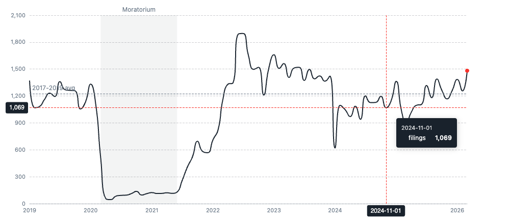
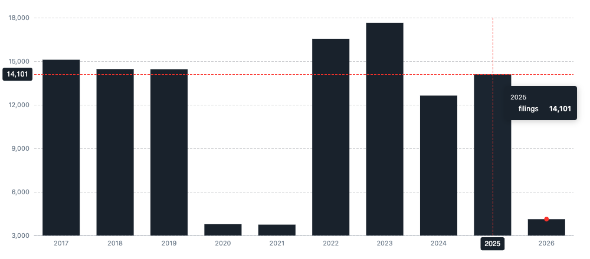
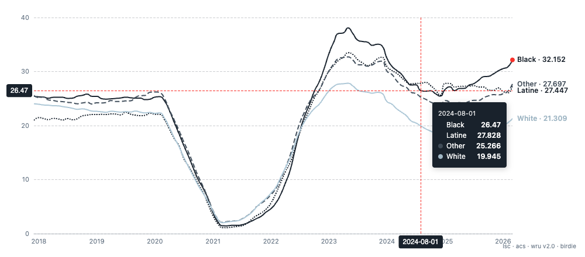
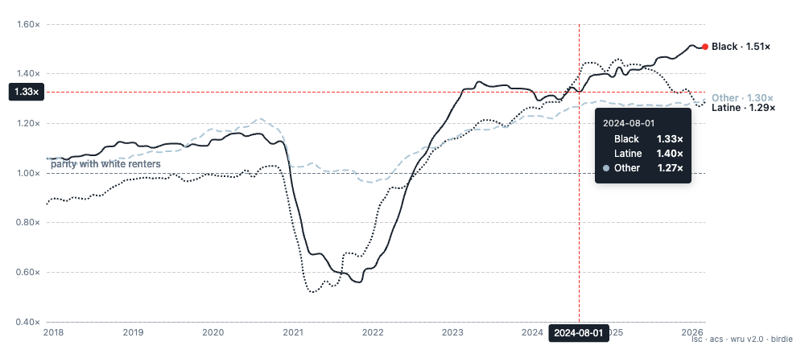
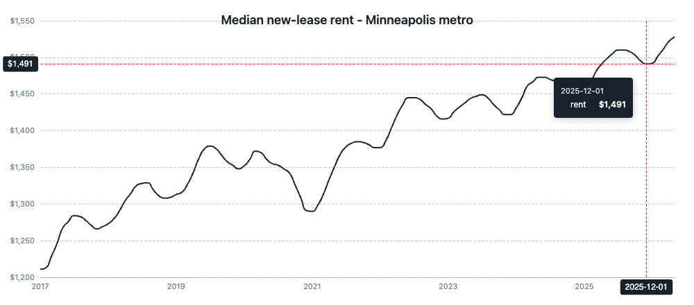

```{r, include = FALSE}
knitr::opts_chunk$set(collapse = TRUE, comment = "#>", eval = FALSE)
```

This tutorial rebuilds the charts from the
[Eviction Research Network Minnesota profile](https://evictionresearch.net/minnesota/)
using `nt_chart()` and the bundled `mn_evictions` data — a monthly eviction trend
with a pre-pandemic baseline and a moratorium band, yearly totals, and rolling
rates by race. Along the way it shows the **"newspaper graphic" hover behavior**
(the y-axis appears only when you hover) and finishes with a real-world example:
pulling Apartment List rent data from a URL to chart regional rents.

The charts are a thin, deterministic wrapper over
[echarts4r](https://echarts4r.john-coene.com/) (John Coene) / Apache ECharts;
`nt_chart()` returns the raw `echarts4r` widget, so you can keep piping `e_*`
functions for anything it doesn't expose.

```{r setup}
library(neighborhood)
library(dplyr)
```

## The data: `mn_evictions`

`mn_evictions` is the public county-month eviction data behind the Minnesota
profile — 87 counties, 2017-01 through 2026-03, with race-imputed counts:

```{r, eval=TRUE}
dplyr::glimpse(neighborhood::mn_evictions)
```

A note on the rate: `rate` is the raw monthly proportion `filings / renters`.
The profiles headline an **annualized rate per 1,000 renter households**, which
you compute over a window as `1000 * sum(filings) * 12 / n_months / renters`.

## 1. The monthly trend (Figure 1)

Roll the counties up to a statewide monthly series, then chart it. The hallmark
ERN touches — a dashed pre-pandemic baseline, a shaded eviction-moratorium band,
and an accented latest point — are each one argument. Set `yaxis = "hover"` so
the y-axis is hidden until the reader hovers, exactly like the live page:

```{r}
statewide <- mn_evictions |>
  group_by(year, month) |>
  summarise(filings = sum(filings), .groups = "drop") |>
  mutate(date = as.Date(sprintf("%d-%02d-01", year, month))) |>
  filter(date >= as.Date("2019-01-01"))

prepan <- mn_evictions |>            # 2017-2019 monthly average = the baseline
  filter(year <= 2019) |>
  group_by(year, month) |>
  summarise(filings = sum(filings), .groups = "drop") |>
  pull(filings) |>
  mean()

nt_chart(
  statewide, "date", "filings", type = "line",
  yaxis          = "hover",                                   # y-axis appears on hover
  baseline       = prepan, baseline_label = "2017-2019 avg",
  band           = c(as.Date("2020-03-01"), as.Date("2021-06-01")),
  band_label     = "Moratorium",
  highlight_last = TRUE
)
```

```{r mn-trend, eval=TRUE, echo=FALSE, out.width="100%", fig.cap="Statewide monthly eviction filings (shown mid-hover): the y-axis and gridlines appear only on hover, with the dashed pre-pandemic baseline, the shaded moratorium band, and the accented latest month."}

```

`yaxis = "hover"` is the option to make the y-axis **disappear while you are not
hovering** and reappear (with dashed gridlines) when you are — the minimalist
newspaper look. The default is `"always"` (labels always shown); `"none"` hides
them entirely and relies on the hover crosshair value.

## 2. Yearly totals (Figure 2)

```{r}
yearly <- mn_evictions |>
  group_by(year) |>
  summarise(filings = sum(filings), .groups = "drop")

nt_chart(yearly, "year", "filings", type = "bar",
         yaxis = "hover", highlight_last = TRUE)   # 2026 is year-to-date
```

```{r mn-bars, eval=TRUE, echo=FALSE, out.width="100%", fig.cap="Yearly eviction-filing totals; the latest (partial) year is accented and the y-axis reveals on hover."}

```

## 3. Rates by race — the published plate (Plate V)

The race chart is a rolling **annualized rate per 1,000 renter households** for
each group. Build the 12-month rolling rate from the imputed counts and the
matching ACS denominators, reshape to long, and pass `group`:

```{r}
roll12 <- function(x) as.numeric(stats::filter(x, rep(1, 12), sides = 1))  # trailing 12-mo sum

race <- mn_evictions |>
  arrange(year, month) |>
  group_by(year, month) |>
  summarise(across(c(filings_black, filings_white, filings_latine, filings_other,
                     renters_black, renters_white, renters_latine, renters_other),
                   sum),          # statewide totals (sum across all 87 counties)
            .groups = "drop") |>
  mutate(date = as.Date(sprintf("%d-%02d-01", year, month)),
         Black  = 1000 * roll12(filings_black)  / renters_black,
         White  = 1000 * roll12(filings_white)  / renters_white,
         Latine = 1000 * roll12(filings_latine) / renters_latine,
         Other  = 1000 * roll12(filings_other)  / renters_other) |>
  tidyr::pivot_longer(c(Black, White, Latine, Other),
                      names_to = "race", values_to = "rate") |>
  filter(!is.na(rate))
```

To match the published plate, lean on the editorial arguments: `end_label` writes
each group's name and latest value at the line end (so no legend is needed),
`line_styles` gives each series a print-legible dash pattern, a mostly-ink
`palette` keeps the comparison group (White) light, `highlight_last` accents the
leading line, and `source` prints the data credit. `yaxis = "hover"` keeps the
scale hidden until the reader hovers:

```{r}
nt_chart(
  race, "date", "rate", group = "race", type = "line",
  yaxis          = "hover",
  end_label      = TRUE,                       # "Black · 33.5" at each line end
  highlight_last = TRUE,                       # red dot on the leading series
  line_styles    = c(Black = "solid", Latine = "dotted",
                     Other = "dashed", White = "solid"),
  palette        = c(Black = "#19222C", Latine = "#19222C",
                     Other = "#3f4b57", White = "#9fb6c4"),
  source         = "lsc · acs · wru v2.0 · birdie"
)
```

```{r mn-race, eval=TRUE, echo=FALSE, out.width="100%", fig.cap="Filing rate by race, rolling annualized per 1,000 renter households (shown mid-hover). Direct end-labels replace the legend, each series has its own line style, and the y-axis appears only on hover."}

```

## 4. The disparity ratio (Plate VI)

The companion plate expresses each group's rate as a **ratio to the white rate** —
above `1.0` means filed against at a higher rate than white renters. Reshape to
wide, divide by `White`, and chart it with a `1.0` parity baseline and
`value_fmt = "multiple"` so values read as `1.52×`:

```{r}
ratio <- race |>
  select(date, race, rate) |>
  tidyr::pivot_wider(names_from = race, values_from = rate) |>
  mutate(Black = Black / White, Latine = Latine / White, Other = Other / White) |>
  tidyr::pivot_longer(c(Black, Latine, Other), names_to = "race", values_to = "ratio") |>
  filter(!is.na(ratio))

nt_chart(
  ratio, "date", "ratio", group = "race", type = "line",
  yaxis          = "hover",
  value_fmt      = "multiple",                 # 1.52x
  end_label      = TRUE, highlight_last = TRUE,
  baseline       = 1, baseline_label = "parity with white renters",
  line_styles    = c(Black = "solid", Latine = "dotted", Other = "dashed"),
  palette        = c(Black = "#19222C", Latine = "#19222C", Other = "#9fb6c4"),
  source         = "lsc · acs · wru v2.0 · birdie"
)
```

```{r mn-ratio, eval=TRUE, echo=FALSE, out.width="100%", fig.cap="Black, Latine, and Other filing rates as a ratio of the white filing rate, with a dashed parity line at 1.0 and end-labels in multiples (shown mid-hover)."}

```

## 5. Sparklines

For the small "trend at a glance" graphic beside a headline number, `nt_spark()`
makes an axis-free line or bar:

```{r}
nt_spark(yearly$filings, type = "bar")
```

## 6. Pulling data from a URL: Apartment List regional rents

A common workflow is to pull a public dataset straight from the web, reshape it,
and chart it. Here we use [Apartment List's Rent
Estimates](https://www.apartmentlist.com/research/category/data-rent-estimates) —
median new-lease rents by metro/city/county — to chart a metro's rent over time.

The download links are content-hashed and change with each monthly release, so we
scrape the current link off the data page, then read the CSV directly:

```{r}
library(readr); library(tidyr); library(stringr); library(lubridate)

# 1. Resolve the current CSV link off the data page. The hash in the path
#    changes each monthly release, so scrape the link rather than hard-coding it
#    (and keep a pinned fallback in case the page serves bot-filtered content).
page <- "https://www.apartmentlist.com/research/category/data-rent-estimates"
html <- paste(readLines(url(page), warn = FALSE), collapse = "\n")
csv_url <- str_extract(
  html,
  "https://assets\\.ctfassets\\.net/[^\"\\\\]*Apartment_List_Rent_Estimates_2[0-9_]+\\.csv"
)
if (is.na(csv_url)) {
  csv_url <- paste0("https://assets.ctfassets.net/jeox55pd4d8n/2nz8cro1T1bopNPDG6Sbsf/",
                    "54e7e1745db655de15aaa99c5570e6ea/Apartment_List_Rent_Estimates_2026_05.csv")
}

# 2. Read it (keep FIPS as character to preserve leading zeros)
rent <- read_csv(csv_url, col_types = cols(location_fips_code = col_character()))

# 3. Pick a metro (by CBSA code) and bed size, reshape wide -> long
mpls <- rent |>
  filter(location_type == "Metro",
         location_fips_code == "33460",   # Minneapolis-St. Paul-Bloomington, MN-WI
         bed_size == "overall") |>
  pivot_longer(matches("^\\d{4}_\\d{2}$"), names_to = "month", values_to = "rent") |>
  mutate(date = ym(month)) |>
  filter(!is.na(rent))

# 4. Chart it
nt_chart(mpls, "date", "rent", type = "line", value_fmt = "currency",
         yaxis = "hover", title = "Median new-lease rent — Minneapolis metro")
```

```{r apt-rent, eval=TRUE, echo=FALSE, out.width="100%", fig.cap="Median new-lease rent for the Minneapolis-St. Paul metro from Apartment List Rent Estimates, pulled live from the URL (shown mid-hover). Data: Apartment List."}

```

To define your own **region** (a set of cities, or several metros), filter to
those rows and aggregate per month — population-weighting is the defensible
choice since each row is already a median:

```{r}
area <- rent |>
  filter(location_type == "City", bed_size == "overall",
         location_fips_code %in% c("2743000", "2758000")) |>   # Minneapolis, St. Paul
  pivot_longer(matches("^\\d{4}_\\d{2}$"), names_to = "month", values_to = "rent") |>
  mutate(date = ym(month)) |>
  filter(!is.na(rent)) |>
  group_by(date) |>
  summarise(rent = weighted.mean(rent, population), .groups = "drop")

nt_chart(area, "date", "rent", type = "line", value_fmt = "currency", yaxis = "hover")
```

Always **attribute** Apartment List on the chart, read the CSV at runtime rather
than redistributing it, and review their terms of use.

## 7. Saving and dropping to echarts4r

A chart is an `htmlwidget`; save a standalone file with
`htmlwidgets::saveWidget()`. And since `nt_chart()` returns the underlying
`echarts4r` widget, keep piping `e_*` for anything else — a data-zoom slider, a
second axis, animations:

```{r}
nt_chart(statewide, "date", "filings", type = "line", yaxis = "hover") |>
  echarts4r::e_datazoom(x_index = 0) |>
  echarts4r::e_title("Minnesota eviction filings")
```

## Acknowledgments

Charts are built on **echarts4r** (John Coene) and Apache ECharts. Minnesota data
are from the Eviction Research Network; Apartment List rent data are pulled from
[apartmentlist.com](https://www.apartmentlist.com/research/category/data-rent-estimates).
For transparency, the `nt_chart()`/`nt_spark()` functions were developed with the
assistance of **Claude Opus 4.8** (Anthropic); they are deterministic R code and
require no AI to run. See `vignette("mapping-with-maplibre")` for the mapping
toolkit and `vignette("precarity-mapping")` for an advanced interactive
precarity map.

## Issues and feedback

Hit a bug, or have a feature request or feedback? Please
[open a GitHub issue](https://github.com/evictionresearch/neighborhood/issues) —
problem reports and suggestions are always welcome.
