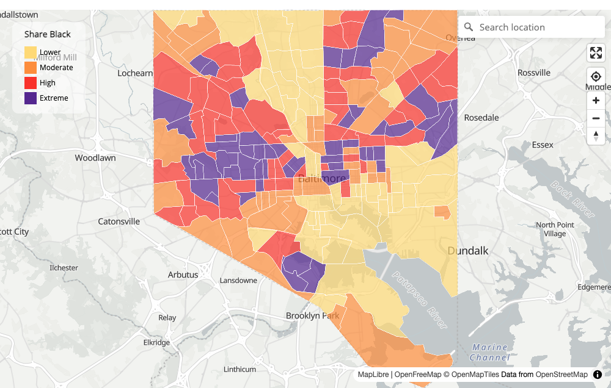

```{r, include = FALSE}
knitr::opts_chunk$set(collapse = TRUE, comment = "#>", eval = FALSE)
```

This tutorial builds an interactive map from nothing to something close to the
[Eviction Research Network](https://evictionresearch.net) state-profile maps
(HPRM, Minnesota, Washington) — and it does so in deterministic R, with no AI in
the loop. We start with a one-line map of neighborhood typologies, then *graft
on* more: a numeric layer, custom breaks and colors, place labels, richer
popups, and — for the full United States — vector tiles.

The mapping functions are a thin, opinionated layer over
[**mapgl**](https://walker-data.com/mapgl/), Kyle Walker's R package for
MapLibre GL JS. Every `nt_*` function returns an ordinary `mapgl` map, so at any
point you can stop using the `neighborhood` shortcuts and reach for the full
`mapgl` toolbox. Census data throughout comes from Walker's
[**tidycensus**](https://walker-data.com/tidycensus/); his book,
[*Analyzing US Census Data*](https://walker-data.com/census-r/), is the best
companion to this vignette.

```{r setup}
library(neighborhood)
library(dplyr)
```

## 1. A map in one line

Map functions need **geometry**. The fastest source is `ntdf()` with
`geometry = TRUE`, which returns an `sf` object of tracts with the
neighborhood-typology columns attached:

```{r}
balt <- ntdf(state = "MD", county = "Baltimore City", geometry = TRUE)

nt_map(balt)
```

```{r typology-map, eval=TRUE, echo=FALSE, out.width="100%", fig.cap="Example output: Baltimore City census tracts colored by neighborhood typology, with the legend, basemap, and address search."}
knitr::include_graphics("figures/map-typologies.png")
```

That single call gives you a finished map: an OpenFreeMap *Positron* basemap, the
view framed to Baltimore, every tract colored by its typology (`nt_conc`) using
the canonical palette, a legend, a hover tooltip, a click popup, and the standard
controls (zoom, fullscreen, locate-me, and an address search box).

When you don't pass `color`, `nt_map()` looks for an `nt_conc` column and maps it.
Point it at any other column to map that instead:

```{r}
nt_map(balt, color = "pBlack")   # share of residents who are Black
```

## 2. The anatomy of a map

`nt_map()` is shorthand. The real workflow is a pipe you compose yourself —
this is what "small or large" means: reach for as many pieces as you need.

```{r}
nt_maplibre(balt) |>                 # 1. basemap + controls + fit to data
  nt_add_choropleth(balt, "nt_conc")  # 2. the colored layer + legend + popup
```

- **`nt_maplibre()`** starts the map: basemap, projection, controls, and (if you
  hand it data) a fit to its bounds. Turn pieces off with `controls = FALSE` or
  `search = FALSE`, change the basemap with `style = "dark"`, etc.
- **`nt_add_choropleth()`** is the workhorse. It colors features by a column and,
  unless told otherwise, adds a matching legend, a hover tooltip, and a click
  popup.

Because the return value is a plain `mapgl` map, you can splice in any `mapgl`
call — here, a scale bar and a layer switcher:

```{r}
nt_maplibre(balt) |>
  nt_add_choropleth(balt, "nt_conc") |>
  mapgl::add_scale_control() |>
  mapgl::add_layers_control()
```

## 3. Categorical maps: typologies

`nt_conc` is a factor with up to 19 levels, and `nt_add_choropleth()` recognizes
it and applies the Eviction Research Network color key automatically (the same
colors as `nt_pal()` for leaflet). You rarely need to touch the colors, but you
can: pass your own `colors`, set `legend = "interactive"` to make the legend
filter the map, or change the `legend_title`.

```{r}
nt_maplibre(balt) |>
  nt_add_choropleth(
    balt, "nt_conc",
    legend       = "interactive",        # click a swatch to isolate that type
    legend_title = "Neighborhood type",
    opacity      = 0.8
  )
```

## 4. Grafting on numbers: income, rent, precarity

Real analysis layers numbers onto the typologies. Any numeric column maps as a
**binned choropleth** using the sequential ERN ramp
(yellow → orange → red → purple). Join whatever you like onto the tracts first.
Here we bring in the affordability index from `afford()` and map the location
quotient of affordable rental supply (`tr_rent_ratio` — values above 1 mean a
tract carries more than its regional "fair share" of housing affordable to the
income group):

```{r}
aff <- afford(state = "24", counties = "510", ami_limit = 0.5, year = 2024,
              geometry = TRUE)

nt_maplibre(aff) |>
  nt_add_choropleth(
    aff, "tr_rent_ratio",
    breaks       = c(0.5, 1, 2),         # interior thresholds (3 breaks -> 4 classes)
    legend_title = "Affordable-rental ratio"
  )
```

```{r numeric-map, eval=TRUE, echo=FALSE, out.width="100%", fig.cap="Example output: a numeric choropleth (here the share of residents who are Black) binned with the four-class ERN ramp -- Lower, Moderate, High, Extreme."}

```

`breaks` are the *interior* thresholds. With the 4-color ramp you supply three of
them. (If you prefer to write all the bin edges including a floor — the
`c(0, 0.5, 1, 2)` style used in the state configs — that works too; the leading
floor is dropped.) Omit `breaks` entirely and the data's quartiles are used.

Prefer a smooth gradient over discrete bins? Switch the type:

```{r}
nt_maplibre(aff) |>
  nt_add_choropleth(aff, "tr_rent_ratio", type = "continuous")
```

`afford()` even precomputes a `popup` column for you, so you can wire up a rich
popup with no extra work:

```{r}
nt_map(aff, color = "tr_rent_ratio", popup = "popup", legend_title = "Affordable-rental ratio")
```

You can layer measures by joining several tables and adding a layer per measure,
then letting `mapgl::add_layers_control()` toggle between them — the same pattern
the HPRM map uses for its eviction-risk / displacement-risk / composite layers:

```{r}
tracts <- balt |>
  left_join(sf::st_drop_geometry(aff), by = "GEOID")

nt_maplibre(tracts) |>
  nt_add_choropleth(tracts, "nt_conc",       id = "typology") |>
  nt_add_choropleth(tracts, "tr_rent_ratio", id = "afford",
                    legend_title = "Afford. ratio") |>
  mapgl::add_layers_control()
```

## 5. Labels

Add place or value labels with `nt_add_labels()`. Labels sit at an interior point
of each polygon (so they never drift into water) and carry a white halo for
legibility. Use `min_zoom` to keep them from cluttering the zoomed-out view:

```{r}
nt_maplibre(balt) |>
  nt_add_choropleth(balt, "nt_conc") |>
  nt_add_labels(balt, "NAME", min_zoom = 11)
```

## 6. Popups, from plain to HPRM-rich

By default the popup lists the tract id and the mapped value. To control it, build
your own HTML with `nt_popup()` and pass the column name (or feed it straight to
`popup =`). `nt_popup()` returns one HTML string per row and is fully
deterministic.

**Start simple** — a title and a few fields:

```{r}
balt$popup <- nt_popup(
  balt,
  title  = "GEOID",
  fields = c(
    "Neighborhood type" = "nt_conc",
    "Total population"   = "totraceE",
    "Share Black"        = "pBlack",
    "Share White"        = "pWhite"
  )
)

nt_map(balt, popup = "popup")
```

Numeric fields format themselves: values in `[0, 1]` render as percentages,
counts get thousands separators.

**Graft on a chart.** The HPRM popup shows a small racial-composition bar chart.
Because a popup is just HTML, you build it in R and append it with the `html`
argument. This is plain string assembly — no JavaScript, fully reproducible:

```{r}
race_bar <- function(p, color, label) {
  sprintf(
    paste0("<div style='display:flex;align-items:center;gap:4px;margin:1px 0'>",
           "<span style='width:46px;font-size:10px;text-align:right'>%s</span>",
           "<span style='flex:1;background:#eee;height:9px'>",
           "<span style='display:block;height:9px;width:%s%%;background:%s'></span>",
           "</span>",
           "<span style='width:30px;font-size:10px'>%s</span></div>"),
    label, round(p * 100), color, scales::percent(p, accuracy = 1)
  )
}

bars <- with(balt, paste0(
  "<div style='margin-top:6px;font-weight:bold;font-size:11px'>Race &amp; ethnicity</div>",
  race_bar(pBlack,  "#1f78b4", "Black"),
  race_bar(pWhite,  "#C95123", "White"),
  race_bar(pAsian,  "#33a02c", "Asian"),
  race_bar(pLatine, "#e31a1c", "Latine")
))

balt$popup <- nt_popup(
  balt,
  title  = "GEOID",
  fields = c("Neighborhood type" = "nt_conc", "Population" = "totraceE"),
  html   = bars
)

nt_map(balt, popup = "popup")
```

**Bubble tracks** — comparing a tract to its county and the nation — follow the
same idea: join the reference values (e.g. a county median and a national median)
onto your data, then build an inline `<svg>` per row positioning a marker on a
0–max track, and pass it through `html`. Everything stays deterministic because
it is just string math over columns you control.

## 7. Large data: the whole country with PMTiles

Embedding tens of thousands of polygons directly in a web page is slow. The
state-profile maps solve this with [PMTiles](https://docs.protomaps.com/pmtiles/)
— a single static vector-tile file served over HTTP range requests. The bundled
`us_nt_tracts2024` table covers every U.S. tract; join it to geometry and build
tiles with `nt_pmtiles()` (which calls the
[`tippecanoe`](https://github.com/felt/tippecanoe) command-line tool — install it
once with e.g. `brew install tippecanoe`):

With `tiles = "auto"` (the default) `nt_add_choropleth()` draws small layers
inline and switches to PMTiles once a layer exceeds `max_inline` (25,000
features); set `tiles = "pmtiles"` to force it:

```{r}
us <- tigris::tracts(cb = TRUE, year = 2024) |>
  left_join(us_nt_tracts2024, by = "GEOID")

nt_maplibre(us) |>
  nt_add_choropleth(us, "nt_conc", tiles = "pmtiles")
```

Need the tiles as a standalone artifact (to host on GitHub Pages, say)? Build
them directly with `nt_pmtiles()` and wire them up with `mapgl`:

```{r}
tiles <- nt_pmtiles(us, path = "us_typologies.pmtiles", layer = "nt")

nt_maplibre() |>
  mapgl::add_pmtiles_source("us", url = tiles, promote_id = "GEOID") |>
  mapgl::add_fill_layer(id = "nt", source = "us", source_layer = "nt",
                        fill_color = "#1f78b4", fill_opacity = 0.7)
```

Host the resulting `.pmtiles` file alongside your HTML and point the source `url`
at it.

## 8. Saving a standalone HTML map

A map is an `htmlwidget`, so a self-contained, shareable HTML file is one call —
the same kind of artifact the ERN state profiles publish:

```{r}
m <- nt_map(balt)
htmlwidgets::saveWidget(m, "baltimore_typologies.html", selfcontained = TRUE)
```

For inline (non-PMTiles) maps the file is fully self-contained. PMTiles maps
additionally need the `.pmtiles` file hosted next to the page.

## 9. When to drop to raw mapgl

The `neighborhood` functions cover the common path. Anything they don't expose,
`mapgl` does — and you never have to leave the pipe to get to it. Reach for
`mapgl` directly for 3-D extrusions (`add_fill_extrusion_layer()`), heatmaps,
custom expressions (`interpolate()`, `step_expr()`, `match_expr()`), draw tools,
bivariate legends, and Shiny integration. See
[the mapgl reference](https://walker-data.com/mapgl/reference/index.html).

## Acknowledgments

This mapping toolkit stands on Kyle Walker's work: **tidycensus** for census data
and **mapgl** for the MapLibre engine. For transparency, the design and
implementation of the `neighborhood` mapping functions were developed with the
assistance of **Claude Opus 4.8** (Anthropic). The functions themselves are
deterministic R code and require no AI to run.
