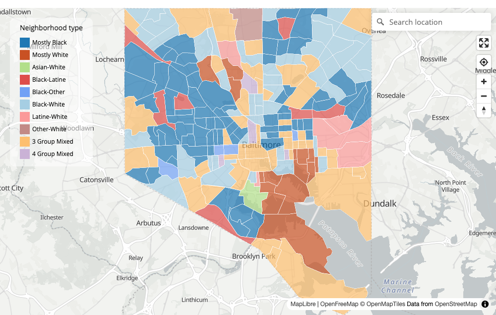

```{r, include = FALSE}
knitr::opts_chunk$set(collapse = TRUE, comment = "#>", eval = FALSE)
```

The neighborhood racial typology is a **descriptive, categorical** measure of
who lives where, at the census-tract scale. Where a single-number segregation
index (such as the [index of
dissimilarity](https://en.wikipedia.org/wiki/Index_of_dissimilarity)) summarizes
a whole region, the typology labels each tract — "All White", "Black-White",
"Diverse", and so on — so you can map the fine-grained pattern of who shares (or
does not share) a neighborhood.

This vignette walks the end-to-end workflow: build the data with `ntdf()`,
inspect and collapse the types with `ntcheck()`, and color or map the result.
The method follows Hall, Crowder, and Spring (2015).[^hall]

[^hall]: Hall, Matthew, Kyle Crowder, and Amy Spring. 2015. "Neighborhood
Foreclosures, Racial/Ethnic Transitions, and Residential Segregation."
*American Sociological Review* 80:526–549.

```{r setup}
library(neighborhood)
library(dplyr)
```

## 1. Build the typologies with `ntdf()`

`ntdf()` pulls the race/ethnicity table from the ACS via
[tidycensus](https://walker-data.com/tidycensus/) (Kyle Walker) and classifies
each tract. A tract is assigned to every group whose population share exceeds
10%; the combination becomes its type. Set `geometry = TRUE` to get an `sf`
object you can map.

```{r}
balt <- ntdf(state = "MD", county = "Baltimore City", geometry = TRUE)

glimpse(balt)
```

Two classification columns come back:

- **`NeighType`** — the full, fine-grained label (there are many possible
  combinations).
- **`nt_conc`** — a *concatenated* version that folds the rare multi-group
  combinations into "3 Group Mixed" / "4 Group Mixed" and the single-group
  variants into "Mostly …". It is an ordered factor with up to 19 levels and is
  what you usually map.

`ntdf()` needs a Census API key (set once with
`tidycensus::census_api_key("YOUR KEY", install = TRUE)`).

## 2. Inspect with `ntcheck()`

Before mapping, see how the types are distributed. `ntcheck()` returns a
frequency table of `NeighType`, most common first — useful for deciding whether
the default `nt_conc` concatenation is collapsed enough for your study area, or
whether some rare types are worth merging further.

```{r}
ntcheck(balt)
```

For a quick national reference, the package ships `us_nt_tracts2024`, a
precomputed table of every U.S. tract built with this same `ntdf()` pipeline (it
is **non-spatial** — see step 4 for mapping it):

```{r}
ntcheck(us_nt_tracts2024)

# Or by state
us_nt_tracts2024 |>
  filter(state == "CA") |>
  count(nt_conc, sort = TRUE)
```

## 3. Color and map

For a **leaflet** map, `nt_pal()` returns the canonical color palette keyed to
`nt_conc`:

```{r}
pal <- nt_pal(balt)

leaflet::leaflet(balt) |>
  leaflet::addProviderTiles("CartoDB.Positron") |>
  leaflet::addPolygons(fillColor = ~pal(nt_conc), fillOpacity = 0.7,
                       weight = 0.3, color = "#ffffff") |>
  leaflet::addLegend(pal = pal, values = ~nt_conc, title = "Neighborhood type")
```

For an interactive **MapLibre** map, you don't even need the palette —
`nt_map()` applies the same colors automatically:

```{r}
nt_map(balt)   # see vignette("mapping-with-maplibre") for the full tour
```

```{r typology-map, eval=TRUE, echo=FALSE, out.width="100%", fig.cap="Example output: Baltimore City tracts colored by neighborhood typology with the canonical ERN palette."}

```

## 4. Mapping the bundled national table

`us_nt_tracts2024` has no geometry, so join it to tract geometry first. For a
single state this is quick; for the whole country, see the PMTiles section of
`vignette("mapping-with-maplibre")`.

```{r}
md_geo <- tigris::tracts(state = "MD", cb = TRUE, year = 2024) |>
  left_join(filter(us_nt_tracts2024, state == "MD"), by = "GEOID")

nt_map(md_geo)
```

## 5. Pairing typologies with affordability

Because both `ntdf()` output and `afford_index()` are keyed on the tract
`GEOID`, you can join them and ask equity questions — for example, *is affordable
housing concentrated in, or absent from, neighborhoods of color?* Map the
affordability ratio and overlay or compare it against the typology.

```{r}
aff <- afford(state = "24", counties = "510", ami_limit = 0.5, year = 2024)

equity <- balt |>
  left_join(aff, by = "GEOID")

# A choropleth of affordable-rental supply, readable next to the typology map
nt_map(equity, color = "tr_rent_ratio", legend_title = "Affordable-rental ratio")
```

For the standardized ELI/VLI/LI/MI tiers and owner/renter cost models, use
`afford_index()` instead (it returns a tidy long table — filter to one
tenure/tier before mapping).

See `vignette("affordability-index")` for the affordability methodology and
`vignette("mapping-with-maplibre")` for the full mapping toolkit.

## Acknowledgments

Census data come from Kyle Walker's **tidycensus**. The MapLibre mapping
functions used here were developed with the assistance of **Claude Opus 4.8**
(Anthropic) for transparency; they are deterministic and require no AI to run.
